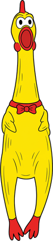
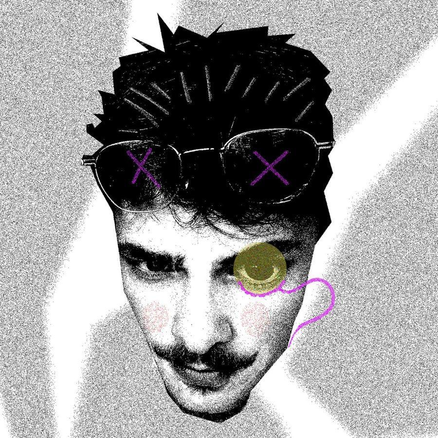

[alex y.](#top)

- [works](#works)
- [about](#about)
- [cv](#cv)
- [say hi](#contact)
- 

Design generalistYerevan, AMOpen to remote

# AlexYandyan

I draw it, model it, animate it and ship it. Graphic & product design, 3D, motion, branding and ads that people actually click.

[see the works ↓](#works) psst… click anything. the chicken likes it.

me, in my natural habitat

certifiedDesignerest. 2021

4+ yrs of making things pop

monocle = detail-oriented ↗

## Selected *works*

Branding, 3D, product, thumbnails, jewelry and motion. Pick one and it blows up into the full story.

careful, they're fragile ✸

## About the *specimen*

### Alex Yandyan

Designus generalis

Habitat

Yerevan, Armenia. Migrates remotely.

Diet

Figma frames, Blender renders, AI pipelines, strong coffee

Call

A rubber-chicken squawk when a layout clicks

Studying

Product Design, NUACA (2023 – 2027)

Status

**Thriving. Open to work.**

Short version: I make things. Long version below.

I'm a design generalist with 4+ years across graphic and product design, 3D, motion, branding and digital advertising. I care about visuals that perform: banners people click, thumbnails people stop on, renders that sell the product before it exists.

Right now I lead design production and visual direction across iGaming projects at Playtronix, building logos, banners, animations and 3D visuals, and wiring AI into the workflow so ideas get explored faster and shipped sharper. Before that: 3D for print and product viz on Upwork, casino assets at Arct X, and two years of thumbnails and banners at Nomi Labs.

AI is part of my everyday professional toolkit, used like any other tool in the pipeline: image and video generation for fast concept exploration, AI-assisted 3D, upscaling and clean-up, and repeatable workflows that take a brief from moodboard to production-ready assets. The ideas, art direction and final polish stay mine; AI just gets me to more options, faster.

#### Where I've been

- **Designer · Playtronix**Jul 2025 – presentVisual direction and production for iGaming brands.
- **3D Designer · Upwork**Oct 2024 – Mar 20253D printing models, product renders, concept to final.
- **3D Designer · Arct X Solution**Apr – Jun 2024Stylized assets and promo graphics for casino platforms.
- **Graphic Designer · Nomi Labs**Jul 2021 – Mar 2023Thumbnails, banners and branded campaign visuals.
- **Side projects · Freelance**\
  YouTube thumbnails, banners and animated visuals for creators; personal 3D art and product concepts.

#### What I'm good at

- Art direction
- Graphic design
- 3D design
- UI design
- Product design
- Industrial design
- Motion
- Creative design
- AI tools & workflows

#### Languages

**Armenian** **Russian** **English**

#### Paperwork

- **Autodesk User Certification**2026
- **TUMO Studios · Jewelry Making**2025
- **Adobe User Group AM**2023

### Take the CV with you

One page, PDF. Experience, tools (Figma, Photoshop, Illustrator, Blender, Substance Painter, 3ds Max, After Effects…), education.

[download CV ↓](Alex_Yandyan_CV.pdf)

## Let's make something squeak.

Emailalexyandyan@gmail.com

Phone+374 98 70 11 55

LinkedIn[in/alexyandyan](https://www.linkedin.com/in/alexyandyan/)[open ↗](https://www.linkedin.com/in/alexyandyan/)

BasedYerevan, Armenia · GMT+4

© 2026 Alex Yandyan. Drawn by hand, mostly.No rubber chickens were harmed. Several were squeezed.